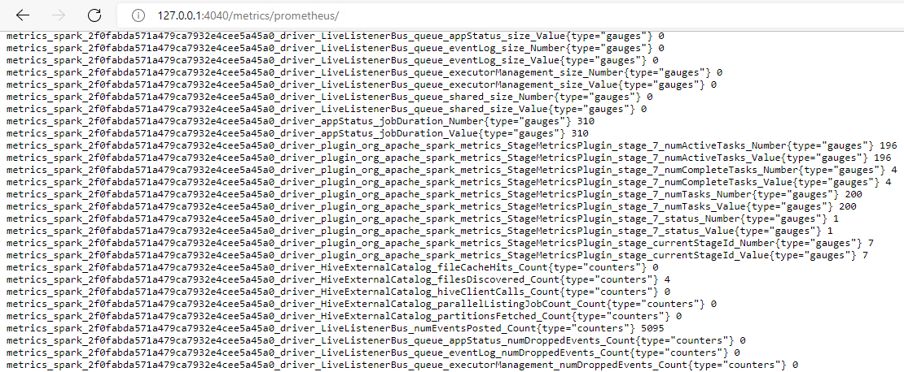

# The "Stage Metrics" plugin for Apache Spark

## Description
The "Stage Metrics" plugin for Apache Spark used for creating metrics by stage status.  
For each stage, several metrics are created that contain the number of all, current and completed tasks.

## Building and enabling the plugin

To build the plugin:
```bash
sbt package
```

To enable the plugin:
- Move the resulting jar file (usually located in `./target/scala-.../`)  
  to the `jars` folder in the Spark root directory(ex: `/opt/spark/jars/`);
- Add to Spark configuration: `spark.plugins=org.apache.spark.metrics.StageMetricsPlugin`.

## Result

After enabling, the following metrics appear in the Spark Web UI in the Driver component instance (in the example - PromQL format):
```
# If the stage is active the value is 1, otherwise 0
metrics_<app-selector>_driver_plugin_org_apache_spark_metrics_stagemetricsplugin_stage_0_status{type="gauge"} 1

# Number of all tasks in stage 0
metrics_<app-selector>_driver_plugin_org_apache_spark_metrics_stagemetricsplugin_stage_0_numTasks{type="gauge"} 10

# Number of active tasks in stage 0
metrics_<app-selector>_driver_plugin_org_apache_spark_metrics_stagemetricsplugin_stage_0_numActiveTasks{type="gauge"} 5

# Number of completed tasks in stage 0
metrics_<app-selector>_driver_plugin_org_apache_spark_metrics_stagemetricsplugin_stage_0_numCompleteTasks{type="gauge"} 1

# Current stage ID
metrics_<app-selector>_driver_plugin_org_apache_spark_metrics_stagemetricsplugin_currentStageId{type="gauge"} 0
```



## Warning

**Not product-ready**  
Once the stage is completed, the metric is not automatically deleted, so with a large number of stages there may be a load on Spark.
